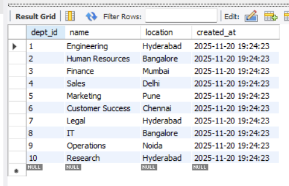
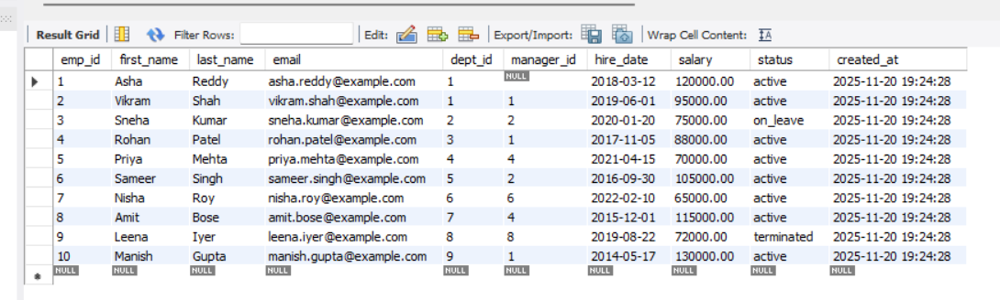
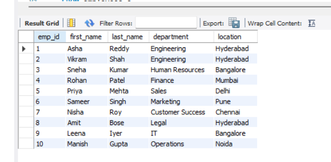
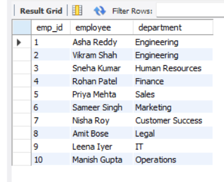
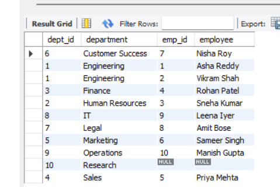
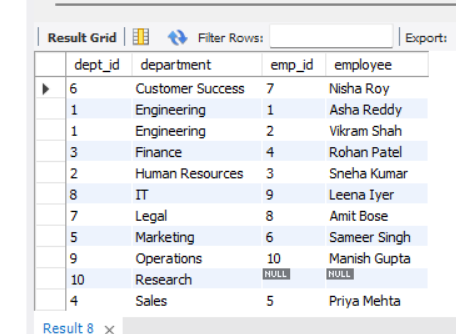
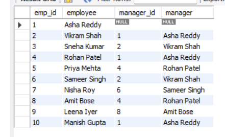
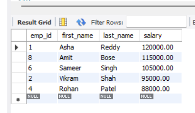
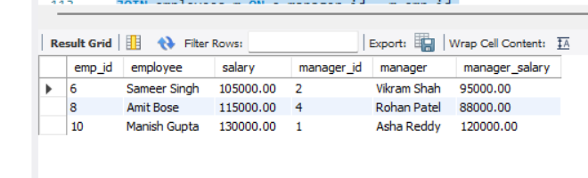

# 🧮 MySQL Employee Database Project

Small, production-minded MySQL sample demonstrating relational modeling (departments, employees with self-referencing manager FK), constraints, indexing, example queries and automated smoke tests. Includes screenshots of query outputs and EXPLAIN plans to show index impact.


## 🧠 Project Overview
This project demonstrates advanced **MySQL concepts** using a realistic employee–department relational database.  
It focuses on **constraints, joins, and indexes** — key components of efficient relational database design.


## 📝 Case Study: Why This Project Matters

Modern companies rely heavily on well-structured databases for decision-making, employee management, and reporting.  
However, many employee–department systems suffer from:
- Poor relational design  
- Missing constraints  
- Slow queries due to lack of indexing  
- Broken or inconsistent hierarchical structures (manager → employee)

### 🎯 Purpose of This Project
I designed this project to **demonstrate real-world MySQL skills** that matter to employers:
- Creating a scalable relational schema  
- Enforcing data integrity with constraints  
- Implementing foreign key relationships  
- Using indexes for performance optimization  
- Writing a wide range of joins used in analytics & BI roles  
- Building a manager–employee hierarchy using self-joins  

**This project is built exactly like what companies use in:**
- HR management systems  
- Employee directory applications  
- Payroll systems  
- Internal analytics dashboards  

### 🧩 What This Project Shows Recruiters
- Ability to design a clean, normalized database  
- Understanding of business-driven database requirements  
- Skill in writing efficient, optimized SQL queries  
- Practical experience implementing constraints & index strategies  
- Ability to model real hierarchical structures (employees → managers)  
- Confidence working with joins used daily in analytics roles  

> **This is not just an SQL script — it's a complete database design case study showing practical MySQL expertise that companies MUST have.**

---

## 🧰 Tools & Technologies
| Tool | Purpose |
|------|----------|
| **MySQL** | Database creation, querying, and optimization |
| **Workbench / CLI** | Query execution and schema visualization |
| **GitHub** | Version control & portfolio documentation |


## 🧩 Database Schema Overview

**Database Name:** `office`

### Tables:
1. **departments**
   - Fields: dept_id, name, location, created_at  
   - Constraints: `PRIMARY KEY`, `UNIQUE`, `NOT NULL`
2. **employees**
   - Fields: emp_id, first_name, last_name, email, dept_id, manager_id, hire_date, salary, status  
   - Constraints: `PRIMARY KEY`, `CHECK (salary > 0)`, `FOREIGN KEY` relationships to departments and employees  
   - Uses **ENUM** and **DEFAULT** values for business logic.

---

## ⚙️ SQL Features Implemented

### 1️⃣ Constraints
- `PRIMARY KEY`, `UNIQUE`, `CHECK`, `DEFAULT`, and `ENUM`
- **Foreign Key Cascades** (`ON DELETE SET NULL`, `ON UPDATE CASCADE`)
- Ensures referential integrity and data validity

### 2️⃣ Indexes
- `idx_departments_name` — speeds up department name lookups  
- `idx_employees_dept` — optimizes department-level joins  
- `idx_employees_last_first` — improves search by employee name  
- `idx_employees_salary` — accelerates range queries on salary

### 3️⃣ Joins
Includes practical examples of all major joins:
- **INNER JOIN** – employees with department details  
- **LEFT JOIN** – all employees, even without departments  
- **RIGHT JOIN** – all departments, with employees if any  
- **FULL OUTER JOIN (via UNION)** – simulated using UNION  
- **SELF JOIN** – employees with their managers  
- **JOIN with condition** – employees earning more than their managers  

---
###  Database Creation


```sql
CREATE DATABASE office;
USE office;
```

###  Table Creation
**departments table**
```sql
CREATE TABLE departments (
dept_id INT AUTO_INCREMENT PRIMARY KEY,
name VARCHAR(100) NOT NULL UNIQUE,
location VARCHAR(100) NOT NULL,
created_at TIMESTAMP DEFAULT CURRENT_TIMESTAMP
);
```

**employees table**
```sql
CREATE TABLE employees (
emp_id INT PRIMARY KEY,
first_name VARCHAR(50) NOT NULL,
last_name VARCHAR(50) NOT NULL,
email VARCHAR(150) NOT NULL UNIQUE,
dept_id INT,
manager_id INT DEFAULT NULL,
hire_date DATE NOT NULL,
salary DECIMAL(10,2) NOT NULL CHECK (salary > 0),
status ENUM('active','on_leave','terminated') DEFAULT 'active',
created_at TIMESTAMP DEFAULT CURRENT_TIMESTAMP,
CONSTRAINT fk_emp_dept FOREIGN KEY (dept_id) REFERENCES departments(dept_id) ON DELETE SET NULL ON UPDATE CASCADE,
CONSTRAINT fk_emp_manager FOREIGN KEY (manager_id) REFERENCES employees(emp_id) ON DELETE SET NULL ON UPDATE CASCADE
) ;
```

**indexes**
```sql
CREATE INDEX idx_departments_name ON departments(name);
CREATE INDEX idx_employees_dept ON employees(dept_id);
CREATE INDEX idx_employees_last_first ON employees(last_name, first_name);
CREATE INDEX idx_employees_salary ON employees(salary);
```

**notes:** MySQL does not implement DEFERRABLE constraints; inserts must respect FK ordering.

### Insert values 
**Insert values into departments**
```sql
INSERT INTO departments (dept_id, name, location) VALUES
(1, 'Engineering', 'Hyderabad'),
(2, 'Human Resources', 'Bangalore'),
(3, 'Finance', 'Mumbai'),
(4, 'Sales', 'Delhi'),
(5, 'Marketing', 'Pune'),
(6, 'Customer Success', 'Chennai'),
(7, 'Legal', 'Hyderabad'),
(8, 'IT', 'Bangalore'),
(9, 'Operations', 'Noida'),
(10, 'Research', 'Hyderabad');
```
✅ Output:


**Insert values into employees** (emp_id chosen explicitly so manager_id can reference earlier rows)
```sql
INSERT INTO employees (emp_id, first_name, last_name, email, dept_id, manager_id, hire_date, salary, status) VALUES
(1, 'Asha', 'Reddy', 'asha.reddy@example.com', 1, NULL, '2018-03-12', 120000.00, 'active'),
(2, 'Vikram', 'Shah', 'vikram.shah@example.com', 1, 1, '2019-06-01', 95000.00, 'active'),
(3, 'Sneha', 'Kumar', 'sneha.kumar@example.com', 2, 2, '2020-01-20', 75000.00, 'on_leave'),
(4, 'Rohan', 'Patel', 'rohan.patel@example.com', 3, 1, '2017-11-05', 88000.00, 'active'),
(5, 'Priya', 'Mehta', 'priya.mehta@example.com', 4, 4, '2021-04-15', 70000.00, 'active'),
(6, 'Sameer', 'Singh', 'sameer.singh@example.com', 5, 2, '2016-09-30', 105000.00, 'active'),
(7, 'Nisha', 'Roy', 'nisha.roy@example.com', 6, 6, '2022-02-10', 65000.00, 'active'),
(8, 'Amit', 'Bose', 'amit.bose@example.com', 7, 4, '2015-12-01', 115000.00, 'active'),
(9, 'Leena', 'Iyer', 'leena.iyer@example.com', 8, 8, '2019-08-22', 72000.00, 'terminated'),
(10, 'Manish', 'Gupta', 'manish.gupta@example.com', 9, 1, '2014-05-17', 130000.00, 'active');
```
✅ Output:


## 🧮 Queries

### 🔹 INNER JOIN — Employees and their Departments
```sql
SELECT e.emp_id, e.first_name, e.last_name, d.name AS department, d.location
FROM employees e
INNER JOIN departments d ON e.dept_id = d.dept_id;
```
✅ Output:


### 🔹 LEFT JOIN — Show every employee, even if they are not assigned to any department, along with the department details if available.
```sql
SELECT e.emp_id, CONCAT(e.first_name, ' ', e.last_name) AS employee, d.name AS department
FROM employees e
LEFT JOIN departments d ON e.dept_id = d.dept_id;
```
✅ Output:

### 🔹 RIGHT JOIN — Show all departments, and if a department has employees, display them too.
```sql
SELECT d.dept_id, d.name AS department, e.emp_id, CONCAT(e.first_name, ' ', e.last_name) AS employee
FROM employees e
RIGHT JOIN departments d ON e.dept_id = d.dept_id;
```
✅ Output:


### 🔹 FULL OUTER JOIN — emulation (MySQL does not support FULL OUTER JOIN directly)
### Show every department and every employee, matching them where possible.
-- return rows that are in left join UNION rows that are in right join but not both
```sql
SELECT d.dept_id, d.name AS department, e.emp_id, CONCAT(e.first_name, ' ', e.last_name) AS employee
FROM departments d
LEFT JOIN employees e ON d.dept_id = e.dept_id
UNION
SELECT d.dept_id, d.name AS department, e.emp_id, CONCAT(e.first_name, ' ', e.last_name) AS employee
FROM departments d
RIGHT JOIN employees e ON d.dept_id = e.dept_id;
```
✅ Output:


### 🔹 SELF JOIN — Employees and their Managers
```sql
SELECT e.emp_id, CONCAT(e.first_name, ' ', e.last_name) AS employee,
m.emp_id AS manager_id, CONCAT(m.first_name, ' ', m.last_name) AS manager
FROM employees e
LEFT JOIN employees m ON e.manager_id = m.emp_id;
```
✅ Output:


### 🔹indexes — Show employees whose salary falls within a specific range
```sql
SELECT emp_id, first_name, last_name, salary 
FROM employees 
WHERE salary BETWEEN 80000 AND 120000 
ORDER BY salary DESC;
```
✅ Output:


### 🔹find employees earning more than their manager
```sql
SELECT e.emp_id, CONCAT(e.first_name, ' ', e.last_name) AS employee, e.salary,
m.emp_id AS manager_id, CONCAT(m.first_name, ' ', m.last_name) AS manager, m.salary AS manager_salary
FROM employees e
JOIN employees m ON e.manager_id = m.emp_id
WHERE e.salary > m.salary;
```
✅ Output:


## 📊 Project Highlights

✅ Enforces data integrity via constraints

⚡ Achieves query optimization using indexes

🔁 Demonstrates all major SQL joins

🧩 Implements self-referencing relationships for hierarchical data

📈 Designed for scalability and performance

## 📚 Key Learnings

Strong understanding of relational data modeling

Importance of constraints and indexing in query optimization

Practical use of JOINs in multi-table queries

Writing clean, reusable SQL scripts for real-world data design

## ▶ How to Reproduce

Copy office_database.sql

Open MySQL Workbench or CLI

Run the script step by step

Execute JOIN and INDEX queries for analysis

## 📎 Repository Link

GitHub Repo: MySQL Employee Database Project

## 🧑‍💻 Author
**Nandini Jella**

## 🧩 Connect With Me
- 🔗 [LinkedIn](https://linkedin.com/in/nandini-jella-a8262b1a0)  
- 📧 Email: nandinijella0095@gmail.com
- 📂 [My Portfolio](https://github.com/nandi-hope)

